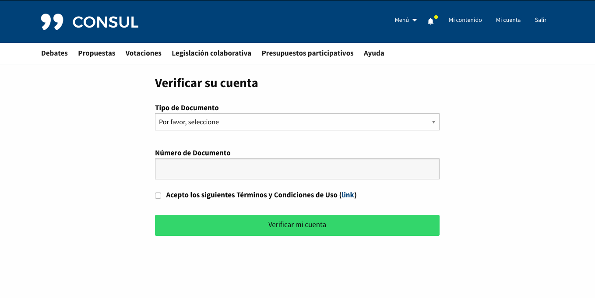
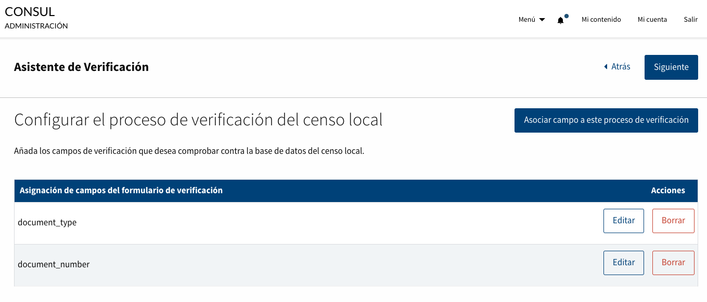

# Configuración básica

Una vez que tengas CONSUL funcionando en el servidor, hay algunas opciones básicas de configuración que probablemente quieras definir para poder empezar a usarlo.

Para ello deberás acceder a tu instalación de CONSUL a través de cualquier navegador de internet e identificarte con el usuario de administración (inicialmente es el usuario `admin@consul.dev` con la contraseña `12345678`). Una vez identificado verás en la parte superior derecha de la pantalla el enlace "Admin" que te llevará a la interfaz de administración. Desde esta interfaz recomendamos configurar las principales opciones básicas a través del asistente de instalación, y una vez configurado recorrer el resto de posibles funcionalidades que se pueden desear accediendo a la sección Configuración desde el submenú de Administración.

## Asistente de instalación
Para acceder al Asistente de instalación, en el menú lateral encontrarás la opción "Configuración" y posteriormente el submenú "Asistentes", donde podremos acceder al "Asistente de instalación".

#### Paso 1 - Bienvenida al Asistente de Instalación
En este asistente realizaremos paso a paso toda la configuración necesaria para poder personalizar la aplicación a las necesidades de su Institución. Si no dispone de alguna información solicitada en el asistente podrá obviarlos y modificarlo en un futuro en la Sección de Configuración relacionada o desde este mismo Asistente.

#### Paso 2 - Configuración Global
En este paso podrá actualizar algunas de las Configuraciones Globales de la aplicación más importantes. En caso de querer modificar alguna una vez realizado el Asistente podrá acceder a la sección "Configuración > Configuración Global" o volviendo a ejecutar el Asistente de Instalación.

- Nombre del sitio. Este nombre aparecerá en el asunto de emails, páginas de ayuda...
- Edad mínima para participar. Si utilizas un sistema de verificación de usuarios esta será la edad mínima que se exigirá a los usuarios. Sobre el sistema de verificación de usuarios se ha incluido un nuevo asistente para poder configurarlo, que será explicado al final de esta sección.

#### Paso 3 - Procesos de participación
En este paso podrán activar/desactivar los procesos de participación que decida utilizar cada Institución. En caso de querer modificar alguna una vez realizado el Asistente podrá acceder a la sección "Configuración > Procesos de Participación" o volviendo a ejecutar el Asistente de Instalación.
- Debates: El espacio de debates ciudadanos está dirigido a que cualquier persona pueda exponer temas que le preocupan y sobre los que quiera compartir puntos de vista con otras personas.
- Propuestas: Las propuestas ciudadanas son una oportunidad para que los vecinos y colectivos decidan directamente cómo quieren que sea su sociedad, después de conseguir los apoyos suficientes y de someterse a votación ciudadana.
- Número de apoyos necesarios para aprobar una Propuesta: Cuando una propuesta alcance este número de apoyos ya no podrá recibir más y se considera exitosa.
- Votaciones: Las votaciones ciudadanas son un mecanismo de participación por el que la ciudadanía con derecho a voto puede tomar decisiones de forma directa.
- Presupuestos participativos: Con los presupuestos participativos la ciudadanía decide a qué proyectos presentados por los vecinos y vecinas va destinada una parte del presupuesto.

#### Paso 4 - Configuración del Mapa
En este paso podrán activar/desactivar la geolocalización de las propuestas y proyectos de gasto, y personalizar la manera en que se muestra el mapa a los usuarios. En caso de querer modificar alguna una vez realizado el Asistente podrá acceder a la sección "Configuración > Configuración del mapa" o volviendo a ejecutar el Asistente de Instalación.
- Geolocalización de propuestas y proyectos de gasto: Permite activar la geolocalización en la aplicación.
- Latitud: Latitud para mostrar la posición del mapa
- Longitud: Longitud para mostrar la posición del mapa
- Zoom: Zoom para mostrar la posición del mapa. Puedes probar con un valor inicial y luego cambiarlo más adelante.

#### Paso 5 - Conexión SMTP
En este paso podrán configurar la conexión SMTP para poder enviar correos desde la aplicación En caso de querer modificar alguna una vez realizado el Asistente podrá acceder a la sección "Configuración > Conexión SMTP" o volviendo a ejecutar el Asistente de Instalación.
- Configuración SMTP: Activa esta funcionalidad para permitir utilizar la configuración SMTP definida en esta sección y poder enviar emails desde la aplicación.
- Host SMTP: Configura el host del servidor SMTP. Ejemplo: 'smtp.example.com'.
- Puerto SMTP: Configura el puerto del servidor SMTP. Ejemplo: 587.
- Dominio: Configura el dominio del servidor SMTP. Ejemplo: 'example.com'.
- Usuario SMTP: Configura el usuario del servidor SMTP. Ejemplo: 'username'.
- Contraseña SMTP: Configura la contraseña del servidor SMTP. Ejemplo: 'password'.
- Autenticación SMTP: Configura el mecanismo de autenticación del servidor SMTP. Ejemplo: 'plain'.
- Activar TLS para SMTP.

#### Paso 6 - Idiomas y Zona horaria
En este paso podrán configurar el idioma por defecto de la aplicación, los idiomas disponibles y la zona horaria en la que se encuentra. En caso de querer modificar alguna una vez realizado el Asistente podrá acceder a la sección "Configuración > Regional Settings" o volviendo a ejecutar el Asistente de Instalación.

- Idioma por defecto: Definir el idioma por defecto de la aplicación mediante el selector que ofrece todos los idiomas disponibles en la aplicación.
- Idiomas disponibles de la aplicación:  Podrá ver todo el listado de idiomas disponibles en la aplicación y habilitar/deshabilitar los que considere oportunos.
- Zona horaria: Permite seleccionar la zona horaria en la que queremos utilizar la aplicación.

#### Paso 7 - Finalización del Asistente
En caso de querer modificar cualquier dato una vez realizado el Asistente podrá modificarlo en la sección Configuración o volviendo a ejecutar el Asistente de Instalación.

Al finalizar el asistente nos redirigirá a la pantalla de Configuración donde podremos modificar tanto los valores introducidos como configurar nuevas funcionalidades y características de la aplicación no contempladas en este Asistente de instalación explicadas en los siguientes apartados.

## Asistente de verificación
Para explicar el funcionamiento de este asistente de verificación vamos a detallar paso a paso el contenido de cada pantalla del asistente y vamos a crear una sección de ejemplos de como crear diferentes procesos de verificación que será el complemento perfecto para entender correctamente esta funcionalidad y poder crear su proceso de verificación personalizado sin problemas.

### Contenido de los Pasos
Para acceder al Asistente de verificación, en el menú lateral encontrarás la opción "Configuración" y posteriormente el submenú "Asistentes", donde podremos acceder al "Asistente de verificación".

#### Paso 1 - Bienvenido al asistente del proceso de verificación
En este asistente realizaremos paso a paso toda la configuración necesaria para poder personalizar el sistema de verificación de usuarios de la aplicación a las necesidades de cada institución.

Para utilizar el proceso de verificación que vamos a configurar en este asistente deberá activar:
- Proceso de verificación de usuario personalizable.
y desactivar:
- Omitir verificación de usuarios.

#### Paso 2 - Métodos de verificación de usuarios
En este paso se puede habilitar o deshabilitar los métodos de verificación de usuario disponibles que desee.
- Verificar un usuario contra el Censo Remoto SOAP: Activar este método de verificación le habilitará una pantalla en los siguientes pasos del asistente para configurar los campos necesarios para conectar con su Censo Remoto SOAP.
- Verificar un usuario contra el Censo Local
- Verificar el teléfono de un usuario por SMS

Una vez creados los campos necesarios para verificar un usuario en el siguiente paso, en función de los métodos de verificación habilitados, aparecerá una pantalla específica para cada método de verificación donde poder asignar cuales de todos los campos definidos son los que le queremos enviar.

#### Paso 3 - Formulario de verificación de usuarios
En este paso podremos definir los campos que solicitaremos al usuario en el formulario de verificación. Y en los siguientes pasos podremos asignar cada uno de estos campos a uno o varios métodos de verificación.

El formulario para crear estos campos ofrece muchas posibilidades para permitir crear cualquier tipo de proceso de verificación.
- Etiqueta: El nombre con el que veremos el campo en el formulario de verificación de un usuario. Ofrece la posibilidad de añadir traducciones.
- Ayuda: Texto informativo que se mostrará al lado del campo que estamos definiendo. A este campo ayuda se le pueden dar diversos usos desde una descripción del campo hasta una definición del formato esperado.
- Nombre: Este es el nombre con el que guardaremos el campo en base de datos. El nombre es necesario que no contenga espacios en blanco y recomendable que este en minúsculas. En caso de ser un campo que se vaya a enviar al Censo Local, el nombre que definimos en este campo es el nombre con el que se intentará verificar el registro.
- Posición: Posición en la que mostraremos el campo en el formulario de verificación.
- Requerido: Marcar este checkbox obligará a rellenar el campo en el formulario. Si no se rellena en el formulario provocará un error de validación.
En caso de no marcarlo servirá para pedir información adicional que no queremos forzar a que el usuario lo introduzca para poder verificarse.
- Requiere campo de confirmación: Marcar este checkbox creará un campo adicional de confirmación. Si no se rellena con el mismo valor  provocará un error de validación. Este campo es útil cuando queremos asegurarnos de que el dato introducido es correcto, como por ejemplo podría ser el número de teléfono al que tenemos que enviar un código de confirmación.
- Visible: Por defecto este checkbox siempre esta marcado ya que la mayoria de los campos que creamos son para mostrarse en el formulario. Hay ciertos casos un poco específicos en los que podemos requerir crear campos que no necesariamente necesitan ser visibles en el formulario, como puede ser un campo del tipo "zona geográfica".
- Formato: En este campo se puede añadir una expresión regular para forzar un formato específico del valor introducido en el formulario de verificación. En caso de no cumplir con está expresión regular se provocará un error en la validación. Para el correcto funcionamiento de este campo es necesario introducir la expresión regular sin los escapados de inicio (/) y final(/). Si este campo se deja en blanco, no se aplica ningún validación de formato.
- Tipo del campo: En este selector se puede elegir que tipo de campo queremos crear:
  - Campo de texto
  - Campo checkbox: Permite forzar que el campo que vamos a crear sea de tipo checkbox y ofrece la posibilidad de añadirle un link asociado a este checkbox. El caso más claro sería querer crear un checkbox de terminos y condiciones de uso, que será necesario marcarlo para poder permitir la verificación y que queremos mostrar un link a una página de la aplicación donde se explican esos términos y condiciones de uso. Para utilizar correctamente este campo adicional se debe rellenar con el slug de una nueva página de nuestra aplicación, para ello debemos acceder a la sección de administración 'Contenido del sitio' > 'Personalizar páginas' y crear la página con el slug introducido.
  - Campo selector: Permite crear un campo del tipo selector y al seleccionarlo en el formulario de creación aparece un botón "Añadir nueva opción para el selector" que nos servirá para crear las opciones con sus respectivos valores que queremos que contenga nuestro selector, ofreciendo dos campos "Etiqueta" y "Valor" y la posibilidad de crear tantas opciones como necesitemos. Un ejemplo para este tipo de campo podría ser un selector para el tipo de documento, donde podríamos crear 2 opciones: (Etiqueta: DNI, valor 0) y (Etiqueta: Pasaporte, valor: 1).
  - Campo fecha

- Zona geográfica: Este checkbox permite marcar un campo del tipo zona geográfica. Este campo se tendrá que asociar con el Censo Remoto y/o el Censo Local en los siguientes pasos. La finalidad de este campo es poder recuperar del Censo Remoto o del Censo local el dato referente a la zona geográfica y poder guardarlo directamente al usuario verificado. Este tipo de campo nos permitirá utilizar las funcionalidades de la aplicación referentes a la zona geográfica en la que se encuentra el usuario, como por ejemplo votar encuestas en función del distrito del usuario.

- Fecha de nacimiento: Esta checkbox permite marcar un campo del tipo fecha de nacimiento. Este campo se tendrá que asociar con el Censo Remoto y/o el Censo Local en los siguientes pasos. La finalidad de este campo es poder recuperar del Censo Remoto o del Censo local la fecha de nacimiento y validar que el usuario verificado cumple la restricción de edad definida en la aplicación.

#### Paso 4 - Configurar el proceso de verificación de censos remotos
Este paso consta de 2 partes:
- Configurar la conexión al censo remoto
  - Endpoint: Nombre del host donde se encuentra el servicio del censo (wsdl)
  - Nombre del método de la petición: Nombre del método que acepta el WebService del Censo del Ayuntamiento.
  - Estructura de la petición: Permite a cada institución definir su propia estructura de la petición de su WebService. Para poder conectar correctamente con su censo remoto esta estructura debe ser un hash con las keys entrecomilladas como puede ver en el siguiente ejemplo:
  { "request": { "static_field": "1", "document_type": "nil", "document_number": "nil", "another_field_required": "nil" } }
  Donde los valores estáticos que se puedan necesitar ya se incluyen en esta estructura, y los valores que van a ser dinámicos de cada usuario los rellenaremos con cualquier string, en este caso de ejemplo hemos utilizado "nil". Para entender correctamente el funcionamiento de esta estructura definida, deberemos acceder al botón "Asociar campo a este proceso de verificación" que comentamos justo en el siguiente punto.
  - Condición para detectar una respuesta válida: Como el WebService de cada institución puede devolver diferentes estructuras en su respuesta se ha definido este campo para poder detectar cuando una respuesta es considerada válida para cada institución. Para poder utilizar correctamente este campo se debe introducir la ruta de la respuesta en la que si viene el campo informado daremos por "valida" esta respuesta. Ejemplo:
  Respuesta válida de nuestro WebService:
  { response: { user: { item: { name: "Tomeu", lastname: "Quely", date_of_bith: "31/12/1980" }}}}
  Respuesta inválida de nuestro WebService:
  { response: { user: {}} }
  En este caso deberíamos rellenar este campo de "Condición para detectar una respuesta válida" con la siguiente ruta "response.user.item".
  Es decir en la respuesta válida nos llega un campo item, y en la respuesta inválida no disponemos de este campo, por lo que la aplicación detectará cualquier respuesta del WebService sin la ruta "response.user.item" como inválida.
- Permitir asociar a este proceso de verificación los campos relacionados definidos en el apartado anterior:(#### Paso 3 - Formulario de verificación de usuarios)
Para asociar campos al proceso de verificación de censo remoto, debemos acceder al botón situado en la parte superior derecha "Asociar campo a este proceso de verificación", o si no hay aún ningún campo asociado desde la tabla que aparecerá vacía existe un link con el mismo objetivo "Asociar campo".
En esta pantalla aparece un selector con todos los campos definidos en el paso 3, donde deberemos asignar uno a uno los campos que queremos que se envíen al censo remoto. En este apartado a parte de la asignación hay dos campos para rellenar con diferentes finalidades que explicamos a continuación:
  - Ruta del campo en la solicitud: Si el campo que estamos asignando necesita ser enviado al Censo Remoto, rellenamos este campo con la ruta en la solicitud. Por ejemplo, si la estructura de petición es:
  { "request": { "static_field": "1", "document_type": "nil", "document_number": "nil", "another_field_required": "nil" } }
  y estamos asignando el campo "document_number" la ruta correcta con la que debemos rellenar este campo es: 'request.document_number'.
  - Ruta del campo en la respuesta: Si el campo que estamos asignando necesita ser validado con la respuesta del censo remoto, rellenamos este campo con la ruta en la respuesta. Esto validará que el valor del campo introducido por el usuario es igual al enviado en la respuesta. Por ejemplo, si la estructura de respuesta es:
  { response: { user: { item: { name: "Tomeu", lastname: "Quely", date_of_bith: "31/12/1980" }}}}
  y estamos asignando el campo "date_of_bith", la ruta correcta con la que debemos rellenar este campo es: "request.date_of_bith".

#### Paso 5 - Configurar el proceso de verificación del censo local
Permitir asociar a este proceso de verificación los campos relacionados definidos en el apartado anterior (#### Paso 3 - Formulario de verificación de usuarios).
Para asociar campos al proceso de verificación de censo local, debemos acceder al botón situado en la parte superior derecha "Asociar campo a este proceso de verificación", o si no hay aún ningún campo asociado desde la tabla que aparecerá vacía existe un link con el mismo objetivo "Asociar campo".
En esta pantalla aparece un selector con todos los campos definidos en el paso 3, donde deberemos asignar uno a uno los campos que queremos que se envíen al censo local para validar que existe un registro guardado con la misma información rellenada por el formulario de verificación.

#### Paso 6 - Configurar el proceso de verificación del teléfono
- Permitir asociar a este proceso de verificación los campos relacionados definidos en el apartado anterior (#### Paso 3 - Formulario de verificación de usuarios).
Para asociar campos al proceso de verificación del teléfono, debemos acceder al botón situado en la parte superior derecha "Asociar campo a este proceso de verificación", o si no hay aún ningún campo asociado desde la tabla que aparecerá vacía existe un link con el mismo objetivo "Asociar campo".
Existe un botón "Crear campos de verificación telefónica", que crea un campo "phone" con las características "requerido" y que "requiera confirmación" y lo asocia directamente a este proceso.
Este proceso envía un sms al número definido por el usuario con un código de 4 dígitos, que tiene que introducir el usuario en el formulario de verificación para poder finalizarlo con éxito.
- Configurar la conexión al servicio SMS:
  Cabe destacar que así como el proceso de verificación de censo remoto se puede personalizar para cualquier institución desde la interfaz, en este caso si el WebService de la institución no se ajusta a las peticiones y respuestas definidas en "lib/sms_api.rb" deberá customizarse la suya propia en "lib/custom/sms_api.rb"??????????.
  - SMS endpoint: Nombre del host donde se encuentra el servicio de SMS
  - Usuario para el servicio de SMS
  - Password para el servicio de SMS

#### Paso 7 - Asistente completado con éxito
En este podrá ver un resumen de los campos configurados durante el asistente.

### Ejemplos de uso
Ejemplo 1: Institución que quiere crear un proceso de verificación básico por censo remoto con un checkbox para aceptar los terminos y condiciones de uso.
- Paso 1: Activar "Proceso de verificación de usuario personalizable" y desactivar "Omitir verificación de usuarios"
- Paso 2: Activar "Verificar un usuario contra el Censo Remoto SOAP" y desactivar "Verificar un usuario contra el Censo Local" y "Verificar el teléfono de un usuario por SMS"
- Paso 3: En este paso necesitamos definir los campos que queremos mostrar en el formulario:
  - Los campos que queremos enviar al censo remoto. Un ejemplo de datos que puede necesitar un WebService de censo (:document_type y :document_number)
  - Un campo para el checkbox de términos y condiciones de uso (:tos)

  Para crear el campo :document_type
  - En el paso "Formulario de verificación de usuarios" clicaremos sobre el botón "Crear campo".
    - Etiqueta: "Tipo de Documento"
    - Nombre: "document_type"
    - Posición: "1"
    - Requerido?: Lo marcaremos para que sea obligatorio introducirlo por el usuario.
    - Requiere campo de confirmación?: En este caso no queremos que nos duplique el campo para confirmarlo.
    - Visualizar el campo?: Por defecto este campo está activo, así que mantendremos la configuración por defecto, para que se muestre al usuario en su formulario de verificación.
    - Tipo del campo: Seleccionaremos "campo selector" y clicaremos en el botón que nos aparece "Añadir nueva opción para el selector". Esto nos ofrecerá unos campos "Etiqueta" y "Valor" que serán las opciones que queremos mostrar al usuario en este campo.
    Un ejemplo sería añadir 2 opciones:
      - Primera opción:
        - Etiqueta: DNI
        - Valor: 1
      - Segunda opción:
        - Etiqueta: Pasaporte
        - Valor: 2
  Una vez rellenados todos estos campos para el :document_type, clicaremos en el botón de "Crear campo". Esto nos redirigirá a la pantalla anterior donde veremos en el listado de campos que ya se ha creado. Y podremos clicar otra vez en "Crear campo" para añadir el siguiente campo que necesitamos en este ejemplo, que sería el "document_number". Como se puede observar en este listado, aparece el campo que acabamos de crear pero en la columna de "Controlador" aparece sin valor, esto es porque aún no lo hemos asignado a ningún proceso de verificación. Primero creamos todos los campos que necesitamos y luego siguiendo el asistente ya asignaremos cada campo a uno o mas controladores/metodos de verificación.

  Para crear el campo :document_number
  - En el paso "Formulario de verificación de usuarios" clicaremos sobre el botón "Crear campo".
    - Etiqueta: "Número de Documento"
    - Nombre: "document_number"
    - Posición: "2"
    - Requerido?: Lo marcaremos para que sea obligatorio introducirlo por el usuario.
    - Requiere campo de confirmación?: En este caso no queremos que nos duplique el campo para confirmarlo.
    - Visualizar el campo?: Por defecto este campo está activo, así que mantendremos la configuración por defecto, para que se muestre al usuario en su formulario de verificación.
    - Tipo del campo: Mantendremos el valor por defecto "Campo de texto".
  Una vez rellenados todos estos campos para el :document_number, clicaremos en el botón de "Crear campo". Esto nos redirigirá a la pantalla anterior donde veremos en el listado de campos que ya se ha creado. En este punto deberíamos ver tanto el registro del :document_type como el registro del :document_number que acabamos de crear. Ahora continuamos con el último campo que nos falta para crear el proceso de verificación definido en el ejemplo.

  Para crear el campo :tos
  - En el paso "Formulario de verificación de usuarios" clicaremos sobre el botón "Crear campo".
    - Etiqueta: "Acepto los siguientes Términos y Condiciones de Uso"
    - Nombre: "terms_and_conditions"
    - Posición: "3"
    - Requerido?: Lo marcaremos para que sea obligatorio introducirlo por el usuario.
    - Requiere campo de confirmación?: En este caso no queremos que nos duplique el campo para confirmarlo.
    - Visualizar el campo?: Por defecto este campo está activo, así que mantendremos la configuración por defecto, para que se muestre al usuario en su formulario de verificación.
    - Tipo del campo: Seleccionaremos "Campo checkbox". Una vez seleccionado nos aparecerá la posibilidad de asociar este checkbox a una página propia de la aplicación donde podremos definir esos términos y condiciones de uso. Este campo "Link que se mostrará al lado de un campo del tipo checkbox" se debe rellenar con el "slug" de la nueva página que podemos crear a través de la sección de administración "Contenido del sitio > Personalizar páginas". En este caso si no se ha creado antes, crearemos la página con el slug que indiquemos en este campo al finalizar el asistente. En este ejemplo el valor con el que vamos a rellenar este campo adicional del link será: "terms-and-conditions"
  Una vez rellenados todos estos campos para el :tos, clicaremos en el botón de "Crear campo". Esto nos redirigirá a la pantalla anterior donde veremos en el listado de campos que ya se ha creado. En este punto deberíamos ver tanto el registro del :document_type, :document_number y el :tos que acabamos de crear.

  Después de haber creado los 3 campos en este paso 3 deberíamos estar viendo en el asistente esta pantalla:
  

- Paso 4: Al haber activado en el paso 2 solo el método de verificación "Verificar un usuario contra el Censo Remoto SOAP", este paso 4 será la forma de asociar los campos creados(:document_type y :document_number) a este método de verificación.
Este paso 4 consta de 2 partes, la primera definir la conexión al censo remoto y la segunda asociar los campos necesarios a este método de verificación:
  - Configurar la conexión al censo remoto: Para rellenar esta sección será necesario un perfil técnico que entienda y tenga acceso a los servicios de Censo que se quieren utilizar.
    - Endpoint: Nombre del host donde se encuentra el servicio del censo (wsdl), por ejemplo: "http://intranet.institución.es:8888/services/CensoService?wsdl"
    - Nombre del método de la petición: Nombre del método que acepta el WebService del Censo del Ayuntamiento, per ejemplo: "get_residents"
    - Estructura de la petición: Para rellenar este campo debemos tener claro que estructura de petición tiene nuestro WebService. Para este ejemplo supondremos que nuestro petición tiene la siguiente estructura:
    { request: { static_field: , document_type: , document_number: } }
    La forma correcta de introducir esta estructura sería la siguiente:
    { "request": { "static_field": "1", "document_type": "nil", "document_number": "nil" } }
    Como podemos observar, los campos estáticos que siempre se envían con el mismo valor ya se dejan con el valor necesario, y los campos dinámicos que se enviaran desde el formulario de verificación es necesarios dejarlos como un string (vease :document_type y :document_number).
    - Condición para detectar una respuesta válida: Que ruta de la respuesta tiene que venir informado para considerarse una respuesta válida. Para rellenar este campo deberemos conocer las respuestas de nuestro WebService y determinar que campo se envia informado cuando la respuesta es válida, que no es enviado cuando la respuesta es inválida. Para entender este campo vamos a poner dos ejemplos de respuestas:
    Respuesta válida:
    {
      get_habita_datos_response: {
        get_habita_datos_return: {
          datos_habitante: {
            item: {
              fecha_nacimiento_string: "31-12-1980",
              identificador_documento: "12345678Z",
              descripcion_sexo: "Varón",
              nombre: "José",
              apellido1: "García"
            }
          },
          datos_vivienda: {
            item: {
              codigo_postal: "28013",
              codigo_distrito: "01"
            }
          }
        }
      }
    }

    Respuesta inválida:
    {
      get_habita_datos_response: {
        get_habita_datos_return: {
          datos_habitante: {},
          datos_vivienda: {}
        }
      }
    }
    Como podemos observar en estos dos ejemplos de respuesta, el campo que llega informado en una respuesta válida y que no llega en una respuesta inválida sería el campo "item" dentro de "datos habitante". Para poder utilizar este campo correctamente si queremos que el campo "item" sea el campo con el que detectaremos si una respuesta es válida o inválida lo deberíamos rellenar con el siguiente texto: "get_habita_datos_response.get_habita_datos_return.datos_habitante.item".

  - Asociar campos a este proceso de verificación: En este ejemplo hemos creado 3 campos, pero solo 2 de ellos los necesitamos para montar la estructura y hacer la petición al censo remoto (:document_type y :document_number). Así que vamos a proceder a asociarlos con el botón que se encuentra en la parte superior derecha "Asociar campo a este proceso de verificación".
    - Asociar :document_type
      - Clicamos en el botón comentado "Asociar campo a este proceso de verificación"
      - En el selector de campo de verificación, seleccionamos :document_type
      - Ahora veremos en la pantalla como hay dos campos nuevos que podemos rellenar "Ruta del campo en la solicitud" y "Ruta del campo en la respuesta". En el ejemplo que hemos planteado, solo necesitamos rellenar correctamente la ruta del campo en la solicitud ya que no hemos creado ningún campo específico que queremos validar en la respuesta (esto lo veremos en otro ejemplo).
      Rellenar el campo "Ruta del campo en la solicitud" correctamente debemos conocer la estructura que hemos definido y rellenarlo de la misma manera que hemos rellenado el campo "Condición para detectar una respuesta válida", es decir tenemos que rellenarlo con la ruta del campo que estamos asociando en la estructura de la petición. Recordamos que la estructura que hemos definido en este ejemplo es:
      { "request": { "static_field": "1", "document_type": "nil", "document_number": "nil" } }
      Por lo que el campo "Ruta del campo en la solicitud" en este caso lo rellenaremos con "request.document_type". De esta manera la aplicación será capaz de montar una petición al endpoint definido, con el nombre del método definido, con la estructura definida y sustituirá el valor de "document_type": "nil" por "document_type": "el valor introducido por el usuario en el formulario de verificación en este campo".
      - Clicamos en Guardar, que nos llevará otra vez a la pantalla anterior para poder volver a asociar otro campo a este método de verificación

    - Asociar :document_number
      - Clicamos en el botón comentado "Asociar campo a este proceso de verificación"
      - En el selector de campo de verificación, seleccionamos :document_number
      - Ahora veremos en la pantalla como hay dos campos nuevos que podemos rellenar "Ruta del campo en la solicitud" y "Ruta del campo en la respuesta". En el ejemplo que hemos planteado, solo necesitamos rellenar correctamente la ruta del campo en la solicitud ya que no hemos creado ningún campo específico que queremos validar en la respuesta (esto lo veremos en otro ejemplo).
      Rellenar el campo "Ruta del campo en la solicitud" correctamente debemos conocer la estructura que hemos definido y rellenarlo de la misma manera que hemos rellenado el campo "Condición para detectar una respuesta válida", es decir tenemos que rellenarlo con la ruta del campo que estamos asociando en la estructura de la petición. Recordamos que la estructura que hemos definido en este ejemplo es:
      { "request": { "static_field": "1", "document_type": "nil", "document_number": "nil" } }
      Por lo que el campo "Ruta del campo en la solicitud" en este caso lo rellenaremos con "request.document_number". De esta manera la aplicación será capaz de montar una petición al endpoint definido, con el nombre del método definido, con la estructura definida y sustituirá el valor de "document_number": "nil" por "document_number": "el valor introducido por el usuario en el formulario de verificación en este campo".

  Una vez hemos asociado los dos campos necesarios y rellenada la información referente a configurar la conexión al censo remoto deberíamos ver esta pantalla:
  

- Paso 5: Asistente completado con éxito! En este ejemplo llegamos directamente a esta pantalla porque solo hemos activado un método de verificación, si hubiésemos activado más métodos, los siguientes pasos hubiesen sido asociar campos a cada uno de esos métodos de verificación.
En este último paso veremos un resumen de todos los campos creados y sus asociaciones con los diferentes métodos de verificación:

Una vez definido todo nuestro proceso de verificación, podemos ver el resultado en la parte pública cuando un usuario quiere verifcarse (verification/process/new):

Ejemplo 2: Institución que quiere crear un proceso de verificación básico por censo local con un checkbox para aceptar los terminos y condiciones de uso y un campo no obligatorio con alguna información que quiera solicitar la institución, pero que no queremos que bloqueé la verificación en caso de no ser informado por el usuario.
- Paso 1: Activar "Proceso de verificación de usuario personalizable" y desactivar "Omitir verificación de usuarios"
- Paso 2: Activar "Verificar un usuario contra el Censo Local" y desactivar "Verificar un usuario contra el Censo Remoto SOAP" y "Verificar el teléfono de un usuario por SMS"
- Paso 3: En este paso necesitamos definir los campos que queremos mostrar en el formulario:
  - Los campos que queremos enviar al censo local. Un ejemplo de datos con los que podemos haber rellenado el censo local (:document_type y :document_number)
  - Un campo para el checkbox de términos y condiciones de uso (:tos)
  - Un campo no obligatorio para solicitar información al usuario (:family_status)

  Para crear el campo :document_type
  - Igual que en el ejemplo 1

  Para crear el campo :document_number
  - Igual que en el ejemplo 1

  Para crear el campo :family_status
  - En el paso "Formulario de verificación de usuarios" clicaremos sobre el botón "Crear campo".
      - Etiqueta: "Estado civil"
      - Ayuda: Este campo no es obligatorio pero puede resultar de utilidad para elaborar estadísticas para la institución
      - Nombre: "family_status"
      - Posición: "3"
      - Requerido?: Lo dejaremos desmarcado para que no sea obligatorio.
      - Requiere campo de confirmación?: En este caso no queremos que nos duplique el campo para confirmarlo.
      - Visualizar el campo?: Por defecto este campo está activo, así que mantendremos la configuración por defecto, para que se muestre al usuario en su formulario de verificación.
      - Tipo del campo: Seleccionaremos "campo selector" y clicaremos en el botón que nos aparece "Añadir nueva opción para el selector". Esto nos ofrecerá unos campos "Etiqueta" y "Valor" que serán las opciones que queremos mostrar al usuario en este campo.
      Un ejemplo sería añadir 2 opciones:
        - Primera opción:
          - Etiqueta: Soltero
          - Valor: 1
        - Segunda opción:
          - Etiqueta: Casado
          - Valor: 2
        - Tercera opción:
          - Etiqueta: Viudo
          - Valor: 3

  Para crear el campo :tos
  - Igual que en el ejemplo 1, pero en la posición 4

  Después de haber creado los 3 campos en este paso 3 deberíamos estar viendo en el asistente esta pantalla:
  

- Paso 4: Al haber activado en el paso 2 solo el método de verificación "Verificar un usuario contra el Censo Local", este paso 4 será la forma de asociar los campos creados(:document_type y :document_number) a este método de verificación.
Este paso 4 para el Censo Local servirá para asociar los campos necesarios a este método de verificación:
  - Asociar campos a este proceso de verificación: En este ejemplo hemos creado 3 campos, pero solo 2 de ellos los necesitamos para montar la estructura y hacer la petición al censo local (:document_type y :document_number). Así que vamos a proceder a asociarlos con el botón que se encuentra en la parte superior derecha "Asociar campo a este proceso de verificación".
    - Asociar :document_type
      - Clicamos en el botón comentado "Asociar campo a este proceso de verificación"
      - En el selector de campo de verificación, seleccionamos :document_type
      - Clicamos en Guardar, que nos llevará otra vez a la pantalla anterior para poder volver a asociar otro campo a este método de verificación

    - Asociar :document_number
      - Clicamos en el botón comentado "Asociar campo a este proceso de verificación"
      - En el selector de campo de verificación, seleccionamos :document_number

  Una vez hemos asociado los dos campos necesarios deberíamos ver esta pantalla:
  

- Paso 5: Asistente completado con éxito! En este ejemplo llegamos directamente a esta pantalla porque solo hemos activado un método de verificación, si hubiésemos activado más métodos, los siguientes pasos hubiesen sido asociar campos a cada uno de esos métodos de verificación.
En este último paso veremos un resumen de todos los campos creados y sus asociaciones con los diferentes métodos de verificación:

Una vez definido todo nuestro proceso de verificación, podemos ver el resultado en la parte pública cuando un usuario quiere verificarse (verification/process/new):

Ejemplo 3: Institución que quiere crear un proceso de verificación básico por SMS con un checkbox para aceptar los terminos y condiciones de uso.
- Paso 1: Activar "Proceso de verificación de usuario personalizable" y desactivar "Omitir verificación de usuarios"
- Paso 2: Activar "Verificar el teléfono de un usuario por SMS" y desactivar "Verificar un usuario contra el Censo Remoto SOAP" y "Verificar un usuario contra el Censo Local"
- Paso 3: En este paso necesitamos definir los campos que queremos mostrar en el formulario:
  - Un campo para que el usuario pueda introducir su teléfono (:phone)
  - Un campo para el checkbox de términos y condiciones de uso (:tos)

  Para crear el campo :phone
  - En el paso "Formulario de verificación de usuarios" clicaremos sobre el botón "Crear campo".
      - Etiqueta: "Teléfono"
      - Nombre: "phone"
      - Posición: "3"
      - Requerido?: Lo dejaremos desmarcado para que no sea obligatorio.
      - Requiere campo de confirmación?: En este caso sí que nos interesa asegurarnos de que la aplicación enviará un sms al teléfono correcto, así que marcaremos este checkbox para que nos cree un campo de confirmación adicional.
      - Visualizar el campo?: Por defecto este campo está activo, así que mantendremos la configuración por defecto, para que se muestre al usuario en su formulario de verificación.
      - Tipo del campo: Seleccionaremos "Campo de Texto"

  Para crear el campo :tos
  - Igual que en el ejemplo 1, pero en la posición 2

  Después de haber creado los 3 campos en este paso 3 deberíamos estar viendo en el asistente esta pantalla:
  

- Paso 4: Al haber activado en el paso 2 solo el método de verificación "Verificar el teléfono de un usuario por SMS", este paso 4 será la forma de asociar el campo creado(:phone) a este método de verificación.
Este paso 4 consta de 2 partes, la primera definir la conexión al servicio de SMS y la segunda asociar los campos necesarios a este método de verificación:
  - Configurar la conexión al servicio de SMS: Para rellenar esta sección será necesario un perfil técnico que entienda y tenga acceso al servicio de SMS que se pretende utilizar. Para utilizar esta funcionalidad debe revisar 'consul/lib/sms_api.rb' y ver que se adapta a sus necesidades.
    - SMS Endpoint: Nombre del host donde se encuentra el servicio de SMS
    - Usuario para el servicio de SMS: Usuario para el servicio de SMS.
    - Password para el servicio de SMS: Password para el servicio de SMS.

  - Asociar campos a este proceso de verificación: En este ejemplo hemos creado 2 campos, pero solo 1 de ellos lo necesitamos enviar un sms al usuario (:phone). Así que vamos a proceder a asociarlos con el botón que se encuentra en la parte superior derecha "Asociar campo a este proceso de verificación".
    - Asociar :phone
      - Clicamos en el botón comentado "Asociar campo a este proceso de verificación"
      - En el selector de campo de verificación, seleccionamos :phone
      - Clicamos en Guardar, que nos llevará otra vez a la pantalla anterior para poder volver a asociar otro campo a este método de verificación

  Una vez hemos asociado los dos campos necesarios y rellenada la información referente a configurar la conexión al servicio de SMS deberíamos ver esta pantalla:
  

- Paso 5: Asistente completado con éxito! En este ejemplo llegamos directamente a esta pantalla porque solo hemos activado un método de verificación, si hubiésemos activado más métodos, los siguientes pasos hubiesen sido asociar campos a cada uno de esos métodos de verificación.
En este último paso veremos un resumen de todos los campos creados y sus asociaciones con los diferentes métodos de verificación:

Una vez definido todo nuestro proceso de verificación, podemos ver el resultado en la parte pública cuando un usuario quiere verificarse (verification/process/new):

Ejemplo 4: Institución que quiere crear un proceso de verificación avanzado por censo remoto con una validación de la edad mínima requerida para participar y permitir actualizar la geolocalización de un usuario y con un checkbox para aceptar los terminos y condiciones de uso.
- Paso 1: Activar "Proceso de verificación de usuario personalizable" y desactivar "Omitir verificación de usuarios"
- Paso 2: Activar "Verificar un usuario contra el Censo Remoto SOAP" y desactivar "Verificar un usuario contra el Censo Local" y "Verificar el teléfono de un usuario por SMS"
- Paso 3: En este paso necesitamos definir los campos que queremos mostrar en el formulario:
  - Los campos que queremos enviar al censo remoto. Un ejemplo de datos que puede necesitar un WebService de censo (:document_type y :document_number)
  - Un campo para el checkbox de términos y condiciones de uso (:tos)

  Para crear el campo :document_type
  - En el paso "Formulario de verificación de usuarios" clicaremos sobre el botón "Crear campo".
    - Etiqueta: "Tipo de Documento"
    - Nombre: "document_type"
    - Posición: "1"
    - Requerido?: Lo marcaremos para que sea obligatorio introducirlo por el usuario.
    - Requiere campo de confirmación?: En este caso no queremos que nos duplique el campo para confirmarlo.
    - Visualizar el campo?: Por defecto este campo está activo, así que mantendremos la configuración por defecto, para que se muestre al usuario en su formulario de verificación.
    - Tipo del campo: Seleccionaremos "campo selector" y clicaremos en el botón que nos aparece "Añadir nueva opción para el selector". Esto nos ofrecerá unos campos "Etiqueta" y "Valor" que serán las opciones que queremos mostrar al usuario en este campo.
    Un ejemplo sería añadir 2 opciones:
      - Primera opción:
        - Etiqueta: DNI
        - Valor: 1
      - Segunda opción:
        - Etiqueta: Pasaporte
        - Valor: 2
  Una vez rellenados todos estos campos para el :document_type, clicaremos en el botón de "Crear campo". Esto nos redirigirá a la pantalla anterior donde veremos en el listado de campos que ya se ha creado. Y podremos clicar otra vez en "Crear campo" para añadir el siguiente campo que necesitamos en este ejemplo, que sería el "document_number". Como se puede observar en este listado, aparece el campo que acabamos de crear pero en la columna de "Controlador" aparece sin valor, esto es porque aún no lo hemos asignado a ningún proceso de verificación. Primero creamos todos los campos que necesitamos y luego siguiendo el asistente ya asignaremos cada campo a uno o mas controladores/metodos de verificación.

  Para crear el campo :document_number
  - En el paso "Formulario de verificación de usuarios" clicaremos sobre el botón "Crear campo".
    - Etiqueta: "Número de Documento"
    - Nombre: "document_number"
    - Posición: "2"
    - Requerido?: Lo marcaremos para que sea obligatorio introducirlo por el usuario.
    - Requiere campo de confirmación?: En este caso no queremos que nos duplique el campo para confirmarlo.
    - Visualizar el campo?: Por defecto este campo está activo, así que mantendremos la configuración por defecto, para que se muestre al usuario en su formulario de verificación.
    - Tipo del campo: Mantendremos el valor por defecto "Campo de texto".
  Una vez rellenados todos estos campos para el :document_number, clicaremos en el botón de "Crear campo". Esto nos redirigirá a la pantalla anterior donde veremos en el listado de campos que ya se ha creado. En este punto deberíamos ver tanto el registro del :document_type como el registro del :document_number que acabamos de crear. Ahora continuamos con el último campo que nos falta para crear el proceso de verificación definido en el ejemplo.

  Para crear el campo :tos
  - En el paso "Formulario de verificación de usuarios" clicaremos sobre el botón "Crear campo".
    - Etiqueta: "Acepto los siguientes Términos y Condiciones de Uso"
    - Nombre: "terms_and_conditions"
    - Posición: "3"
    - Requerido?: Lo marcaremos para que sea obligatorio introducirlo por el usuario.
    - Requiere campo de confirmación?: En este caso no queremos que nos duplique el campo para confirmarlo.
    - Visualizar el campo?: Por defecto este campo está activo, así que mantendremos la configuración por defecto, para que se muestre al usuario en su formulario de verificación.
    - Tipo del campo: Seleccionaremos "Campo checkbox". Una vez seleccionado nos aparecerá la posibilidad de asociar este checkbox a una página propia de la aplicación donde podremos definir esos términos y condiciones de uso. Este campo "Link que se mostrará al lado de un campo del tipo checkbox" se debe rellenar con el "slug" de la nueva página que podemos crear a través de la sección de administración "Contenido del sitio > Personalizar páginas". En este caso si no se ha creado antes, crearemos la página con el slug que indiquemos en este campo al finalizar el asistente. En este ejemplo el valor con el que vamos a rellenar este campo adicional del link será: "terms-and-conditions"
  Una vez rellenados todos estos campos para el :tos, clicaremos en el botón de "Crear campo". Esto nos redirigirá a la pantalla anterior donde veremos en el listado de campos que ya se ha creado. En este punto deberíamos ver tanto el registro del :document_type, :document_number y el :tos que acabamos de crear.

  Después de haber creado los 3 campos en este paso 3 deberíamos estar viendo en el asistente esta pantalla:
  

- Paso 4: Al haber activado en el paso 2 solo el método de verificación "Verificar un usuario contra el Censo Remoto SOAP", este paso 4 será la forma de asociar los campos creados(:document_type y :document_number) a este método de verificación.
Este paso 4 consta de 2 partes, la primera definir la conexión al censo remoto y la segunda asociar los campos necesarios a este método de verificación:
  - Configurar la conexión al censo remoto: Para rellenar esta sección será necesario un perfil técnico que entienda y tenga acceso a los servicios de Censo que se quieren utilizar.
    - Endpoint: Nombre del host donde se encuentra el servicio del censo (wsdl), por ejemplo: "http://intranet.institución.es:8888/services/CensoService?wsdl"
    - Nombre del método de la petición: Nombre del método que acepta el WebService del Censo del Ayuntamiento, per ejemplo: "get_residents"
    - Estructura de la petición: Para rellenar este campo debemos tener claro que estructura de petición tiene nuestro WebService. Para este ejemplo supondremos que nuestro petición tiene la siguiente estructura:
    { request: { static_field: , document_type: , document_number: } }
    La forma correcta de introducir esta estructura sería la siguiente:
    { "request": { "static_field": "1", "document_type": "nil", "document_number": "nil" } }
    Como podemos observar, los campos estáticos que siempre se envían con el mismo valor ya se dejan con el valor necesario, y los campos dinámicos que se enviaran desde el formulario de verificación es necesarios dejarlos como un string (vease :document_type y :document_number).
    - Condición para detectar una respuesta válida: Que ruta de la respuesta tiene que venir informado para considerarse una respuesta válida. Para rellenar este campo deberemos conocer las respuestas de nuestro WebService y determinar que campo se envia informado cuando la respuesta es válida, que no es enviado cuando la respuesta es inválida. Para entender este campo vamos a poner dos ejemplos de respuestas:
    Respuesta válida:
    {
      get_habita_datos_response: {
        get_habita_datos_return: {
          datos_habitante: {
            item: {
              fecha_nacimiento_string: "31-12-1980",
              identificador_documento: "12345678Z",
              descripcion_sexo: "Varón",
              nombre: "José",
              apellido1: "García"
            }
          },
          datos_vivienda: {
            item: {
              codigo_postal: "28013",
              codigo_distrito: "01"
            }
          }
        }
      }
    }

    Respuesta inválida:
    {
      get_habita_datos_response: {
        get_habita_datos_return: {
          datos_habitante: {},
          datos_vivienda: {}
        }
      }
    }
    Como podemos observar en estos dos ejemplos de respuesta, el campo que llega informado en una respuesta válida y que no llega en una respuesta inválida sería el campo "item" dentro de "datos habitante". Para poder utilizar este campo correctamente si queremos que el campo "item" sea el campo con el que detectaremos si una respuesta es válida o inválida lo deberíamos rellenar con el siguiente texto: "get_habita_datos_response.get_habita_datos_return.datos_habitante.item".

  - Asociar campos a este proceso de verificación: En este ejemplo hemos creado 3 campos, pero solo 2 de ellos los necesitamos para montar la estructura y hacer la petición al censo remoto (:document_type y :document_number). Así que vamos a proceder a asociarlos con el botón que se encuentra en la parte superior derecha "Asociar campo a este proceso de verificación".
    - Asociar :document_type
      - Clicamos en el botón comentado "Asociar campo a este proceso de verificación"
      - En el selector de campo de verificación, seleccionamos :document_type
      - Ahora veremos en la pantalla como hay dos campos nuevos que podemos rellenar "Ruta del campo en la solicitud" y "Ruta del campo en la respuesta". En el ejemplo que hemos planteado, solo necesitamos rellenar correctamente la ruta del campo en la solicitud ya que no hemos creado ningún campo específico que queremos validar en la respuesta (esto lo veremos en otro ejemplo).
      Rellenar el campo "Ruta del campo en la solicitud" correctamente debemos conocer la estructura que hemos definido y rellenarlo de la misma manera que hemos rellenado el campo "Condición para detectar una respuesta válida", es decir tenemos que rellenarlo con la ruta del campo que estamos asociando en la estructura de la petición. Recordamos que la estructura que hemos definido en este ejemplo es:
      { "request": { "static_field": "1", "document_type": "nil", "document_number": "nil" } }
      Por lo que el campo "Ruta del campo en la solicitud" en este caso lo rellenaremos con "request.document_type". De esta manera la aplicación será capaz de montar una petición al endpoint definido, con el nombre del método definido, con la estructura definida y sustituirá el valor de "document_type": "nil" por "document_type": "el valor introducido por el usuario en el formulario de verificación en este campo".
      - Clicamos en Guardar, que nos llevará otra vez a la pantalla anterior para poder volver a asociar otro campo a este método de verificación

    - Asociar :document_number
      - Clicamos en el botón comentado "Asociar campo a este proceso de verificación"
      - En el selector de campo de verificación, seleccionamos :document_number
      - Ahora veremos en la pantalla como hay dos campos nuevos que podemos rellenar "Ruta del campo en la solicitud" y "Ruta del campo en la respuesta". En el ejemplo que hemos planteado, solo necesitamos rellenar correctamente la ruta del campo en la solicitud ya que no hemos creado ningún campo específico que queremos validar en la respuesta (esto lo veremos en otro ejemplo).
      Rellenar el campo "Ruta del campo en la solicitud" correctamente debemos conocer la estructura que hemos definido y rellenarlo de la misma manera que hemos rellenado el campo "Condición para detectar una respuesta válida", es decir tenemos que rellenarlo con la ruta del campo que estamos asociando en la estructura de la petición. Recordamos que la estructura que hemos definido en este ejemplo es:
      { "request": { "static_field": "1", "document_type": "nil", "document_number": "nil" } }
      Por lo que el campo "Ruta del campo en la solicitud" en este caso lo rellenaremos con "request.document_number". De esta manera la aplicación será capaz de montar una petición al endpoint definido, con el nombre del método definido, con la estructura definida y sustituirá el valor de "document_number": "nil" por "document_number": "el valor introducido por el usuario en el formulario de verificación en este campo".

  Una vez hemos asociado los dos campos necesarios y rellenada la información referente a configurar la conexión al censo remoto deberíamos ver esta pantalla:
  

- Paso 5: Asistente completado con éxito! En este ejemplo llegamos directamente a esta pantalla porque solo hemos activado un método de verificación, si hubiésemos activado más métodos, los siguientes pasos hubiesen sido asociar campos a cada uno de esos métodos de verificación.
En este último paso veremos un resumen de todos los campos creados y sus asociaciones con los diferentes métodos de verificación:

Una vez definido todo nuestro proceso de verificación, podemos ver el resultado en la parte pública cuando un usuario quiere verifcarse (verification/process/new):

## Parámetros de la configuración global
En el menú lateral encontrarás la opción "Configuración" y posteriormente el submenú "Configuración global". Aquí encontrarás muchos parámetros interesantes, pero por el momento te recomendamos definir algunos de los más básicos. Más adelante cuando estés más familiarizado con la herramienta podrás volver a configurar otros parámetros:

- Nombre del sitio. Este nombre aparecerá en el asunto de emails, páginas de ayuda...
- Nombre email remitente. Este nombre aparecerá como nombre del remitente en los emails enviados desde la aplicación. Como por ejemplo el email que los usuarios reciben para confirmar que han creado su cuenta.
- Dirección email remitente. Esta dirección de email aparecerá en los emails enviados desde la aplicación.
- URL general de la web. URL principal de tu web.
- Edad mínima para participar. Si utilizas un sistema de verificación de usuarios esta será la edad mínima que se exigirá a los usuarios. Sobre el sistema de verificación de usuarios hablaremos en más detalle más adelante.
- Número de apoyos necesarios para aprobar una Propuesta. Si utilizas la sección de propuestas ciudadanas, puedes definir un mínimo de apoyos que necesitan las propuestas para ser consideradas. Cualquier usuario podrá crear propuestas pero solo las que lleguen a ese valor serán tenidas en cuenta.
- Cargos públicos de nivel x. CONSUL permite que algunas cuentas de usuario se marquen como "cuentas oficiales" apareciendo más resaltadas sus intervenciones en la plataforma. Esto por ejemplo se usa en una ciudad si se quieren definir cuentas para el Alcalde, los Concejales, etc. Esta opción de cargos públicos te permitirá definir la etiqueta oficial que aparece al lado de los nombres de usuario de estas cuentas de mayor importancia (nivel 1) a menor (nivel 5).

## Categorías de las propuestas
Cuando los usuarios crean propuestas en la plataforma se sugieren unas categorías generales, para ayudar a organizar las propuestas. Para definir estas categorías puedes entrar en el menú "Configuración global" y luego en el submenú "Temas de propuestas". En la parte superior puedes escribir temas y crearlos con el botón que aparece a continuación.

##  Definición de geozonas
Las geozonas son áreas territoriales más pequeñas que la zona en la que usas CONSUL (por ejemplo los distritos en una ciudad en la que se use CONSUL). Si las activas permitirá por ejemplo que las propuestas ciudadanas se asignen a una zona concreta, o que las votaciones estén restringidas a la gente que viva en alguna zona.

En el menú lateral encontrarás la opción "Configuración" y posteriormente el submenú "Gestionar distritos". A la derecha el botón "Crear distrito" te permitirá crear nuevas geozonas. Solo el nombre es necesario para definirlas, pero podrás agregar otros datos que son útiles en ciertas secciones. Inicialmente te recomendamos que empieces definiendo sólo los nombres de las zonas.

Una vez definidas si creas una propuesta ciudadana verás como una de las opciones en el formulario de creación te permite elegir si tu propuesta se refiere a una geozona concreta.

Si activas las geozonas puedes también mostrar una imagen que represente el área con las zonas. Esta imagen puedes cambiarla en el menú "Configuración global" en el submenú "Personalizar imágenes". La imagen por defecto que podrás cambiar es la titulada "map".

##  Mapa para geolocalizar propuestas
Puedes permitir que al crear propuestas los usuarios puedan situarlas en un mapa. Para ello tienes que definir qué mapa quieres mostrar.

Accede en primer lugar al menú  "Configuración" y posteriormente al submenú "Configuración global". Allí encontrarás tres parámetros que tendrás que rellenar:

- Latitud. Latitud para mostrar la posición del mapa
- Longitud. Longitud para mostrar la posición del mapa
- Zoom. Zoom para mostrar la posición del mapa. Puedes probar con un valor inicial y luego cambiarlo más adelante.

En la parte superior de esta página encontrarás tres pestañas: "Configuración Global", "Funcionalidades" y "Configuración del Mapa". Accede ahora a la segunda pestaña "Funcionalidades".

En esta página encontrarás una de las funcionalidades titulada como "Geolocalización de propuestas y proyectos de gasto". Deberá aparecer el mensaje "Funcionalidad activada" a su derecha. Si no es así haz click en el botón "Activar".

A continuación, en la parte superior de esta página accede a la pestaña "Configuración del Mapa". Si todo ha sido configurado correctamente verás aquí el mapa centrado en la latitud y longitud que introdujiste antes. Puedes centrar correctamente el mapa y cambiar el nivel de zoom directamente sobre el mapa, pulsando luego el botón "Actualizar" que hay debajo de él.

##  Emails a usuarios
CONSUL envía por defecto una serie de correos electrónicos a los usuarios. Por ejemplo al crear una cuenta de usuario, al intentar recuperar la contraseña, al recibir un mensaje de otro usuario, etc.

Todos los correos que se envían puedes visualizarlos en el menú "Mensajes a usuarios" en el submenú "Emails del sistema". Ahí podrás previsualizar cada correo electrónico y ver el archivo donde está el contenido del correo por si quieres cambiarlo.

## Páginas básicas de información
CONSUL cuenta con una serie de páginas básicas de información que se mostrarán a los usuarios. Por ejemplo "Política de Privacidad", "Preguntas Frecuentes", "Felicidades acabas de crear tu cuenta de usuario", etc.

Puedes ver las páginas que existen por defecto y modificarlas en el menú "Contenido del sitio" en el submenú "Personalizar Páginas".

## Página principal del sitio
Al acceder a tu instalación de CONSUL los usuarios verán la página principal de la plataforma. Esta página es totalmente configurable, para que muestres el contenido que te parezca más relevante. Puedes modificarla desde el menú "Contenido del sitio" en el submenú "Homepage".

Prueba a crear "Encabezados" y "Tarjetas" y a activar las diferentes funcionalidades que encontrarás debajo para ver el efecto que producen en tu página principal.

## Textos de la plataforma
Si accedes al menú "Contenido del sitio" y al submenú "Personalizar textos" verás diferentes pestañas con una serie de textos. Estos son todos los textos que se muestran en la plataforma. Por defecto puedes utilizar los que existen, pero en cualquier momento puedes acceder a esta sección para modificar cualquiera de los textos.

Para tener más información sobre cómo añadir nuevas traducciones a tu versión de CONSUL accede a la sección "Textos y traducciones" de esta documentación.

## Canales de participación
Por defecto encontrarás en CONSUL diferentes formas de participación para los usuarios. Para empezar y familiarizarte con la plataforma te recomendamos tenerlos todos activados, pero puedes desactivar todos los que no te parezcan necesarios. Para ello accede al menú "Configuración" y posteriormente al submenú "Configuración global". En la parte superior de esta página encontrarás tres pestañas: "Configuración Global", "Funcionalidades" y "Configuración del Mapa". Accede a la segunda pestaña "Funcionalidades".

Encontrarás diversas funcionalidades con los nombres de los diferentes canales de participación "Debates", "Propuestas", "Votaciones", "Legislación Colaborativa" y "Presupuestos Participativos". Puedes desactivar cualquiera de las funcionalidades y dejará de mostrarse en tu instalación de CONSUL.

###  Más información y documentación detallada
Estas opciones anteriores te permitirán tener una versión básica de CONSUL que empezar a usar. Te recomendamos acceder a la sección [Documentación y guías sobre CONSUL](../getting_started/consul_guides.md) donde podrás encontrar más documentación detallada.
